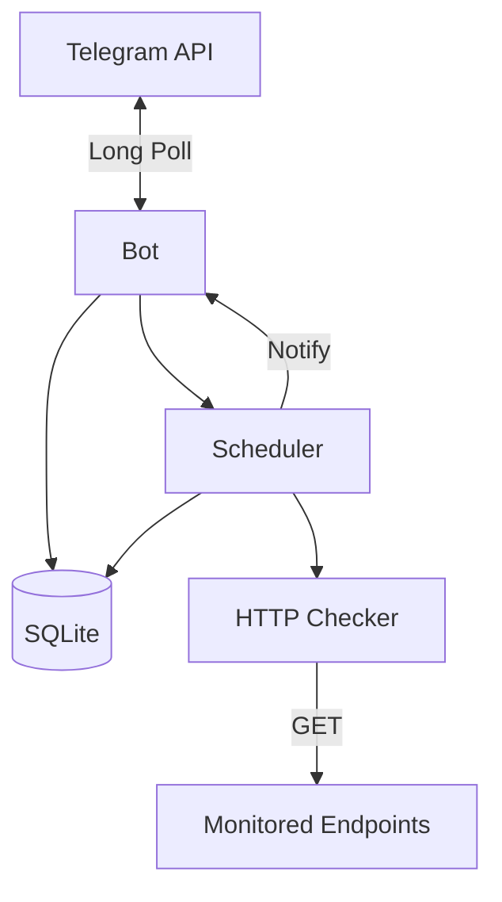

# Technology Stack: Showcase-Ready Tooling

**Project:** Noroshi (Uptime Monitor)
**Researched:** 2026-03-26
**Scope:** CI/CD, linting, badges, testing patterns, architecture diagrams -- NOT core application stack (locked: Go, SQLite, gocron, retryablehttp, telebot, goose)

---

## Recommended Stack

### CI/CD: GitHub Actions

| Technology | Version | Purpose | Why |
|------------|---------|---------|-----|
| `actions/checkout` | v6 | Repository checkout | Current stable. v6.0.2 is latest (Jan 2026). |
| `actions/setup-go` | v6 | Go environment setup | v6.3.0 is latest (Feb 2025). Built-in module caching via `go.mod`. |
| GitHub-native workflow status badge | N/A | CI status in README | No external service needed. Uses `github/actions/workflow/status` shields.io route. |

**Confidence:** HIGH -- all verified via official GitHub release pages.

**Workflow structure:** Use a single workflow file (`.github/workflows/ci.yml`) with two jobs that run in parallel:
1. **build-and-test** -- checkout, setup-go, `go vet`, `go build`, `go test -coverprofile`
2. **lint** -- checkout, setup-go, golangci-lint

Parallel jobs because linting failures should not block test results (and vice versa). Both must pass for PR merge.

**Key settings:**
- Trigger on `push` to `main`/`develop` and on `pull_request`
- Use `go-version-file: go.mod` in setup-go (reads version from go.mod, no hardcoding)
- Set `CGO_ENABLED: 0` as environment variable (matches project constraint)
- Run `go mod download` before build steps (populates cache correctly)

```yaml
# Skeleton -- .github/workflows/ci.yml
name: CI
on:
  push:
    branches: [main, develop]
  pull_request:

permissions:
  contents: read

env:
  CGO_ENABLED: 0

jobs:
  build-and-test:
    runs-on: ubuntu-latest
    steps:
      - uses: actions/checkout@v6
      - uses: actions/setup-go@v6
        with:
          go-version-file: go.mod
      - run: go mod download
      - run: go vet ./...
      - run: go build ./cmd/monitor/
      - run: go test -race -coverprofile=coverage.out ./...

  lint:
    runs-on: ubuntu-latest
    steps:
      - uses: actions/checkout@v6
      - uses: actions/setup-go@v6
        with:
          go-version-file: go.mod
      - uses: golangci/golangci-lint-action@v9
        with:
          version: v2.11
```

### Linting: golangci-lint v2

| Technology | Version | Purpose | Why |
|------------|---------|---------|-----|
| `golangci-lint` | v2.11.x | Meta-linter (runs 90+ linters) | Industry standard for Go. v2 released March 2025, now mature. |
| `golangci/golangci-lint-action` | v9 | GitHub Actions integration | v9.0.0 is latest. Requires golangci-lint >= v2.1.0. |

**Confidence:** HIGH -- version numbers verified from official GitHub releases page and golangci-lint-action README.

**Configuration:** Use `.golangci.yml` in project root with v2 format.

The `standard` preset is the default and includes core linters: `errcheck`, `govet`, `ineffassign`, `staticcheck`, `unused`, `gosimple`, and others. The exact list can be verified with `golangci-lint linters` after install.

**Recommended `.golangci.yml` for this project:**

```yaml
version: "2"

linters:
  default: standard
  enable:
    # Bug prevention
    - bodyclose        # Checks HTTP response body is closed
    - contextcheck     # Checks function uses correct context (critical for this project)
    - errorlint        # Finds issues with error wrapping
    - noctx            # Finds HTTP requests without context
    - sqlclosecheck    # Checks SQL rows/statements are closed
    # Style
    - misspell         # Finds misspelled English words
    - unconvert        # Removes unnecessary type conversions
    - unparam          # Finds unused function parameters
    - goconst          # Finds repeated strings that could be constants
    # Formatting (as linters, not formatters)
    - gofmt            # Enforces standard formatting
    - goimports        # Enforces import grouping

  settings:
    misspell:
      locale: US

formatters:
  enable:
    - gofmt
    - goimports

run:
  timeout: 3m
  relative-path-mode: cfg
```

**Why these specific linters beyond standard:**
- `contextcheck`: The project has a strict rule against `context.Background()` outside `main.go`. This linter enforces it automatically.
- `bodyclose` + `noctx`: The project does HTTP health checks. These catch resource leaks and missing context propagation.
- `sqlclosecheck`: The project uses `database/sql` directly. Unclosed rows are a common leak.
- `errorlint`: The project uses custom `AppError` with `errors.Is`/`errors.As`. This linter ensures wrapping is done correctly.

**What NOT to use:**
- `golangci-lint` v1.x -- EOL, no longer maintained. v2 is the only supported version.
- `revive` (enable separately) -- The standard preset already includes govet and staticcheck which cover most of what revive does. Only add if you want stricter style rules.
- `gofumpt` -- Stricter than `gofmt`. Unnecessary for a solo project; `gofmt` is sufficient and universally understood.

### README Badges

| Badge | Service | URL Pattern | Why |
|-------|---------|-------------|-----|
| CI Status | shields.io + GitHub Actions | `img.shields.io/github/actions/workflow/status/USER/noroshi/ci.yml?branch=main` | Shows build health. Most important badge for credibility. |
| Go Report Card | goreportcard.com | `goreportcard.com/badge/github.com/USER/noroshi` | Standard Go project quality signal. Runs gofmt, govet, gocyclo, etc. |
| Go Reference | pkg.go.dev | `pkg.go.dev/badge/github.com/USER/noroshi` | Standard Go documentation badge. Links to auto-generated docs. |
| License | shields.io | `img.shields.io/github/license/USER/noroshi` | Shows project is properly licensed. |
| Go Version | shields.io | `img.shields.io/github/go-mod/go-version/USER/noroshi` | Shows Go version from go.mod. |

**Confidence:** HIGH -- shields.io URL patterns verified via official docs. Go Report Card and pkg.go.dev badge endpoints are stable, long-lived services.

**Badge order in README (standard convention):**
```markdown
[](https://github.com/USER/noroshi/actions)
[](https://goreportcard.com/report/github.com/USER/noroshi)
[](https://pkg.go.dev/github.com/USER/noroshi)
[](LICENSE)
```

**What NOT to use:**
- Coverage badges (Codecov/Coveralls) -- These require external service accounts and tokens. Not worth the complexity for a portfolio project with modest test coverage. Add later if coverage exceeds 80%.
- Custom/vanity badges -- Keep it standard. Non-standard badges look unprofessional.

### Architecture Diagrams: Mermaid

| Technology | Version | Purpose | Why |
|------------|---------|---------|-----|
| Mermaid.js | N/A (GitHub-rendered) | Architecture diagrams in README/docs | GitHub natively renders Mermaid in markdown. No build step, no image files, version-controlled as text. |

**Confidence:** HIGH -- GitHub Mermaid support is well-documented and stable since 2022.

**Usage:** Wrap diagram code in a fenced code block with `mermaid` language identifier. GitHub renders it automatically.

**Diagram types relevant to this project:**
- `flowchart TD` -- Component architecture (main diagram for README)
- `sequenceDiagram` -- Health check flow (good for DESIGN.md)
- `erDiagram` -- SQLite schema (good for DESIGN.md)

**Example component diagram for Noroshi:**
````markdown

````

**What NOT to use:**
- Image files for diagrams (`.png`, `.svg`) -- Cannot be diffed, easy to get stale, require separate tooling to generate.
- PlantUML -- Requires server-side rendering or GitHub Action to convert. Mermaid is natively supported.
- ASCII art -- Hard to maintain, looks unprofessional in a showcase project.
- draw.io/Excalidraw -- Good for complex diagrams but overkill here. Generates binary files that cannot be diffed.

### Testing Patterns: Telegram Bot Handler Mocks

| Pattern | Purpose | Why |
|---------|---------|-----|
| Manual `tele.Context` mock struct | Test bot handlers without Telegram API | `tele.Context` is an interface (~40 methods). Write a mock struct that implements the methods used by handlers. No external library needed (project forbids testify/gomock). |
| `tele.NewContext(bot, update)` | Create real context from fake Update | Telebot v4 exposes `NewContext` which creates a real `nativeContext`. Requires a `tele.Bot` instance (needs token validation, less suitable for unit tests). |

**Confidence:** MEDIUM -- verified `tele.Context` is an interface by reading telebot v4 source code (`context.go`). Mock approach is standard Go testing pattern. However, the interface has ~40 methods which makes manual mocking verbose.

**Recommended approach: Thin mock with embedding**

Since the project forbids external test libraries, use a struct that embeds an interface to satisfy the compiler, then override only the methods each test needs:

```go
// mockContext is a test helper that implements tele.Context.
// Embed the interface so only methods under test need implementation.
type mockContext struct {
    tele.Context // embedded, panics if unimplemented method called

    sendCalls []sendCall
    editCalls []editCall
    respondCalls []respondCall

    message  *tele.Message
    callback *tele.Callback
    chatID   int64
}

type sendCall struct {
    Text string
    Opts []interface{}
}

func (m *mockContext) Send(what interface{}, opts ...interface{}) error {
    if text, ok := what.(string); ok {
        m.sendCalls = append(m.sendCalls, sendCall{Text: text, Opts: opts})
    }
    return nil
}

func (m *mockContext) Chat() *tele.Chat {
    return &tele.Chat{ID: m.chatID}
}

func (m *mockContext) Message() *tele.Message {
    return m.message
}

func (m *mockContext) Callback() *tele.Callback {
    return m.callback
}

func (m *mockContext) Respond(resp ...*tele.CallbackResponse) error {
    // capture for assertions
    return nil
}
```

**Why this pattern:**
- Standard Go idiom: embed interface, override what you need
- No external dependencies (satisfies CLAUDE.md constraint)
- Captures sent messages for assertion
- Each test can configure only what it needs
- If an unexpected method is called, the nil-embedded-interface panics -- which is actually desirable in tests (fail fast on wrong assumptions)

**Store and Scheduler mocks already follow this pattern** -- the project already defines `Store` and `Scheduler` as interfaces in `internal/bot/bot.go`. The mock implementations for tests are straightforward:

```go
type mockStore struct {
    endpoints   map[int64]storage.Endpoint
    addErr      error
    getErr      error
    // ... per-method control
}

type mockScheduler struct {
    addCalls    []storage.Endpoint
    removeCalls []int64
    addErr      error
}
```

**Test coverage strategy for bot package:**
1. Test each handler independently by constructing a `mockContext` with appropriate `Message().Payload` or `Callback().Data`
2. Verify the mock's `sendCalls` / `editCalls` contain expected response text
3. Verify `mockStore` and `mockScheduler` received expected calls
4. Test the `guarded` middleware by varying `Chat().ID`
5. Test error paths by setting `addErr`/`getErr` on mock store

### Coverage Reporting (Lightweight)

| Technology | Version | Purpose | Why |
|------------|---------|---------|-----|
| `go test -coverprofile` | stdlib | Generate coverage data | Built into Go toolchain. No external dependency. |
| Terminal output | N/A | Coverage percentage in CI logs | `go tool cover -func=coverage.out` shows per-function coverage. Visible in GitHub Actions logs. |

**Confidence:** HIGH -- stdlib, always available.

**What NOT to use (yet):**
- Codecov/Coveralls -- Requires account setup, token management, additional GitHub Action steps. Overhead not justified until the project has comprehensive coverage (>80%) worth showcasing.
- Coverage badges -- Without a coverage service, generating a badge requires extra CI steps (e.g., parsing coverage output and generating a badge SVG). Not worth it in initial iteration.

---

## Alternatives Considered

| Category | Recommended | Alternative | Why Not |
|----------|-------------|-------------|---------|
| CI Platform | GitHub Actions | GitLab CI, CircleCI | Project is on GitHub. Actions is zero-config, free for public repos. |
| Linter | golangci-lint v2 | standalone govet + staticcheck | golangci-lint runs both plus dozens more in one tool. Single config file. |
| Linter action | golangci-lint-action v9 | Manual `go install` + run | Action handles caching, version pinning, and GitHub annotation output. |
| Diagrams | Mermaid (inline) | PlantUML, draw.io exports | Mermaid renders natively on GitHub. No build step. Text-based = diffable. |
| Bot test mocks | Manual mock structs | testify/mock, gomock | Project constraint: stdlib `testing` only. Manual mocks are clear and sufficient for this scale. |
| Coverage service | None (CI logs only) | Codecov, Coveralls | Setup overhead not justified. Coverage is visible in CI logs. Revisit at >80% coverage. |
| Formatting | gofmt (via golangci-lint) | gofumpt | gofmt is the Go standard. gofumpt adds stricter rules that may surprise contributors. |

---

## Installation / Setup

```bash
# golangci-lint v2 (local development)
# Official install script (recommended):
curl -sSfL https://raw.githubusercontent.com/golangci/golangci-lint/HEAD/install.sh | sh -s -- -b $(go env GOPATH)/bin v2.11.4

# Or via go install:
go install github.com/golangci/golangci-lint/v2/cmd/golangci-lint@v2.11.4

# Verify
golangci-lint version
golangci-lint linters  # Shows which linters are enabled by your config
```

No other installations needed. GitHub Actions handles CI tooling. Mermaid requires no install (GitHub-rendered). Badges are URL-based (no install).

---

## Version Summary

| Tool | Pinned Version | Latest Verified | Notes |
|------|---------------|-----------------|-------|
| `actions/checkout` | v6 | v6.0.2 (Jan 2026) | Use `@v6` tag (auto-patches) |
| `actions/setup-go` | v6 | v6.3.0 (Feb 2025) | Use `@v6` tag, `go-version-file: go.mod` |
| `golangci-lint` | v2.11.4 | v2.11.4 (Mar 2026) | Pin exact version in CI |
| `golangci-lint-action` | v9 | v9.0.0 | Use `@v9` tag |

---

## Sources

- [golangci-lint releases](https://github.com/golangci/golangci-lint/releases) -- version verification
- [golangci-lint-action README](https://github.com/golangci/golangci-lint-action) -- v9 compatibility, usage examples
- [golangci-lint v2 announcement](https://ldez.github.io/blog/2025/03/23/golangci-lint-v2/) -- v2 config structure, presets
- [golangci-lint v2 configuration docs](https://golangci-lint.run/docs/configuration/file/) -- reference YAML structure
- [golangci-lint v2 migration guide](https://www.khajaomer.com/blog/level-up-your-go-linting) -- recommended linters, contextcheck
- [actions/setup-go releases](https://github.com/actions/setup-go/releases) -- v6.3.0 verification
- [actions/checkout releases](https://github.com/actions/checkout/releases) -- v6.0.2 verification
- [GitHub Mermaid support](https://github.blog/developer-skills/github/include-diagrams-markdown-files-mermaid/) -- native rendering confirmation
- [shields.io](https://shields.io/) -- badge URL patterns
- [Go Report Card](https://goreportcard.com/) -- badge service for Go projects
- [pkg.go.dev badge](https://pkg.go.dev/badge/) -- Go documentation badge
- [telebot v4 context.go](https://github.com/tucnak/telebot/blob/v4/context.go) -- Context interface definition (~40 methods, is an interface)
- [GitHub Actions Go CI docs](https://docs.github.com/actions/automating-builds-and-tests/building-and-testing-go) -- official GitHub guide
